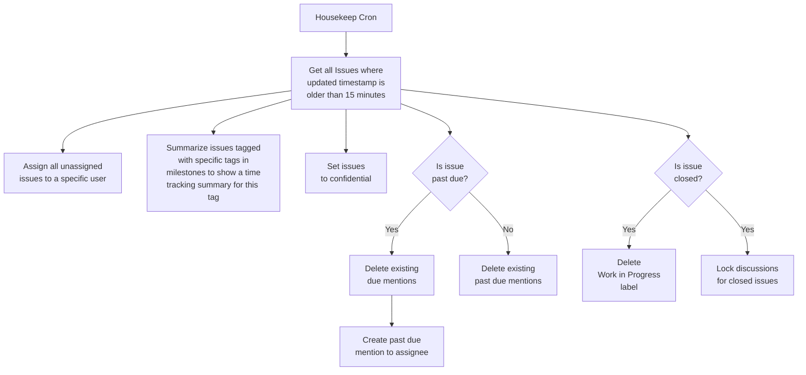
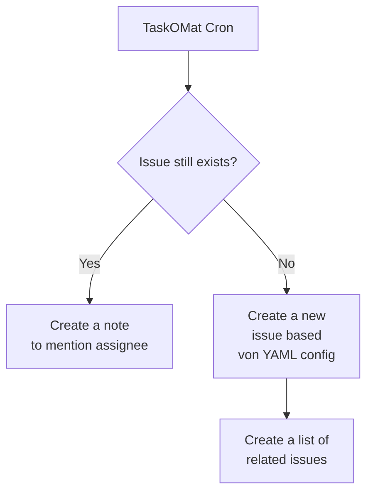

# TaskOMat GitLab Issue Bot

This is a script collection to manage GitLab issues.

## Housekeeping

This cron ensures certain rules on all issues.

```sh
# from a gitlab-ci pipeline
# uses the buildin variables
#
# also requires the TASKOMAT_TOKEN variable
# which must contain a valid access token of the
# bot user in the CI Pipeline Variables

./housekeep.py --gitlab-url "$CI_SERVER_URL" \
    --project "$CI_PROJECT_PATH" \
    --assignee $assignee \
    --delay 900 \
    --max-updated-age 2592000 \
    --milestone-label Bürokratie \
    --milestone-label Wohnung
```



## TaskOMat

This script creates issues from YAML files. When
the specific issue already/still exists it creates
just a mention to the assignee.

```sh
# from a gitlab-ci pipeline
# uses buildin variables and pipeline scheduler variables
#
# also requires the TASKOMAT_TOKEN variable
# which must contain a valid access token of the
# bot user in the CI Pipeline Variables

./taskomat.py --gitlab-url "$CI_SERVER_URL" \
    --project "$CI_PROJECT_PATH" \
    --collection-dir ./$CRON_COLLECTION \
    --max-updated-age 7776000
```


