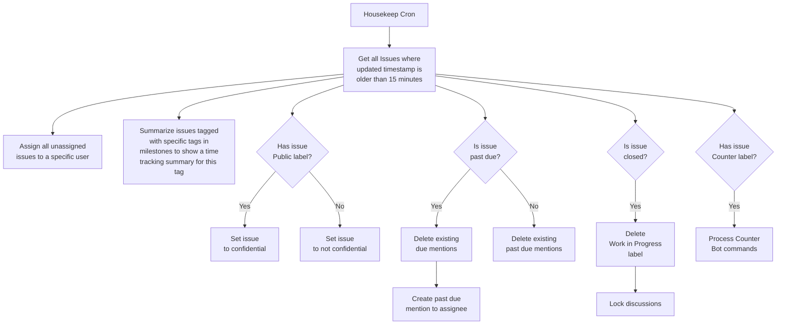

# TaskOMat GitLab Issue Bot

This is a script collection to manage GitLab issues.

## Changelog 2022-12-23

- All issues will be set to confidential if they don't have a `Public` label assigned
- The label `Work in Progress` will be removed from closed issues
- Support for starting housekeep.py via Web Hook for a single issue

## Housekeeping

This cron ensures certain rules on all issues.

```sh
# from a gitlab-ci pipeline
# uses the buildin variables
#
# also requires the TASKOMAT_TOKEN variable
# which must contain a valid access token of the
# bot user in the CI Pipeline Variables

./housekeep.py --gitlab-url "$CI_SERVER_URL" \
    --project "$CI_PROJECT_PATH" \
    --assignee $assignee \
    --delay 900 \
    --max-updated-age 2592000 \
    --milestone-label Bürokratie \
    --milestone-label Wohnung \
    [--issue-iid 42]
```



### Counter

If a issue has a `Counter` label assigned, the housekeep script will look for
commands starting with `!` in notes and creates a statistic from it.

```txt
!countunit km
!countgoal 1000
!count 20
[...]
```

will result in

`TaskOMat:countersummary` :tea: Here is the TaskOMat counter summary:

**Processed:** 65 items  
**Time range:** 2022-05-28 - 2022-12-21  
**Smallest Amount:** 2.0 km  
**Largest Amount:** 102.0 km

**Goal:**  


| Month | Items | Amount |
|---|---|---|
| 2022-05 | 9 | 162.0 km |
| 2022-06 | 13 :tada: | 383.0 km :tada: |
| 2022-07 | 5 | 108.0 km |
| 2022-08 | 13 | 208.0 km |
| 2022-09 | 12 | 147.0 km |
| 2022-10 | 7 | 124.0 km |
| 2022-11 | 5 | 67.0 km |
| 2022-12 | 1 | 32.0 km |

**Total:** 1231.0 km (+32.0 km last)

### Run by Web Hook

Executing the housekeeping script by a web hook allows a almost-instant
apply of the TaskOMat rules. It will start a new pipeline for each single
modified issue. 

The pipeline YAML will extract the issue iid from the
trigger payload and will start housekeep with `--issue-iid $ISSUE_ID`.

```yml
# .gitlab-ci.yml example
stages:
  - task

variables:
  assignee: 2
  # 5 minutes
  updated_min_hk: 0
  # 30 days
  updated_max_hk: 2592000

# -> Templates
.tpl:default:
  image: taskomat:latest
  stage: task
  tags:
    - docker

# -> Tasks
webhook:housekeep:
  extends: .tpl:default
  script:
    # find issue iid
    - 'if [ -z "${TRIGGER_PAYLOAD:-}" ] || [ ! -f "$TRIGGER_PAYLOAD" ]; then echo "Trigger payload file not found."; exit 0; fi'
    #- 'cat $TRIGGER_PAYLOAD'
    - "ISSUE_ID=$(cat $TRIGGER_PAYLOAD | jq '.issue.iid // .object_attributes.iid')"
    - 'if [ "$ISSUE_ID" == "null" ] || [ $ISSUE_ID -le 0 ]; then echo "No issue iid found."; exit 0; fi'
    # execute housekeeper
    - |
      /src/housekeep.py \
        --gitlab-url "$CI_SERVER_URL" \
        --project "$CI_PROJECT_PATH" \
        --assignee $assignee \
        --milestone-label Vereinsarbeit \
        --delay $updated_min_hk \
        --max-updated-age $updated_max_hk \
        --issue-iid $ISSUE_ID
  only:
    refs:
      - master
      - triggers
    variables:
      - $TRIGGER_PAYLOAD
```

Webhook:

- URL: https://git.example.com/api/v4/projects/42/ref/master/trigger/pipeline?token=XXXXXXXXXXXXXXXXX
- Comments
- Confidential comments
- Issue events
- Confidential issues events
- Enable SSL verification

## TaskOMat

This script creates issues from YAML files. When
the specific issue already/still exists it creates
just a mention to the assignee.

```sh
# from a gitlab-ci pipeline
# uses buildin variables and pipeline scheduler variables
#
# also requires the TASKOMAT_TOKEN variable
# which must contain a valid access token of the
# bot user in the CI Pipeline Variables

./taskomat.py --gitlab-url "$CI_SERVER_URL" \
    --project "$CI_PROJECT_PATH" \
    --collection-dir ./$CRON_COLLECTION \
    --max-updated-age 7776000
```


